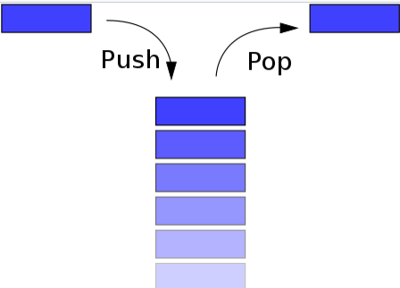
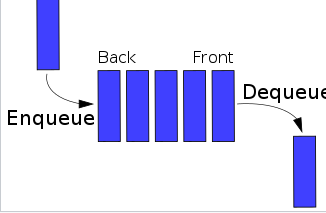

# StackAndQueue

<hr>

### Stack



1. 스택이란?
    1. java.util.Stack: public class Stack extends List<E>
    2. LAST IN FIRST OUT (LIFO)
        1. 나중에 들어간 것이 먼저 나오기
        2. 먼저 들어간 것이 나중에 나오기
    3. code
       ```java
       import java.util.Stack;
       
       class StackAndQueue {
           public static void main(String[] args){
               //1. 생성
               Stack<Integer> stack = new Stack<>();
               //2. 삽입
               stack.push(1);
               stack.push(2);
               stack.push(3);
               //3. 제거
               Integer pop = stack.pop();
               //4. 탑(peek)에 있는 거 뽑기
               Integer peek = stack.peek();
           }
       }
       ```
2. 문제

- 스택으로 오름차순 수열 만들기

```java
public class StackAndQueue {
    public static void main(String[] args) throws IOException {
        Scanner scan = new Scanner(System.in);
        int n = scan.nextInt();
        int[] orders = new int[n];
        Stack<Integer> input = new Stack<>();
        for (int i = 0; i < n; i++) {
            orders[i] = scan.nextInt();
        }
        StringBuffer stringBuffer = new StringBuffer();
        //초기값
        int num = 1;
        boolean result = true;
        for (int i = 0; i < n; i++) {
            int inputNum = orders[i];
            // 들어온 값이 이전값보다 크면 들어온 값까지 push후에 pop
            if (num <= inputNum) {
                while (num <= inputNum) {
                    input.add(num++);
                    stringBuffer.append("+\n");
                }
                input.pop();
                stringBuffer.append("-\n");
                // 들어온 값이 이전값보다 작으면 지금 탑 값과 같으면 pop, 아니면 No
            } else {
                int pop = input.pop();
                if (pop != inputNum) {
                    System.out.println("NO");
                    result = false;
                    break;
                }
                stringBuffer.append("-\n");
            }
        }
        if (result) System.out.println(stringBuffer.toString());
    }
}
```

- 스택으로 오름차순 수열 만들기

```java
public class StackAndQueue {
    public static void main(String[] args) throws IOException {
        Scanner scan = new Scanner(System.in);
        int n = scan.nextInt();
        int[] orders = new int[n];
        Stack<Integer> input = new Stack<>();
        for (int i = 0; i < n; i++) {
            orders[i] = scan.nextInt();
        }
        StringBuffer stringBuffer = new StringBuffer();
        //초기값
        int num = 1;
        boolean result = true;
        for (int i = 0; i < n; i++) {
            int inputNum = orders[i];
            // 들어온 값이 이전값보다 크면 들어온 값까지 push후에 pop
            if (num <= inputNum) {
                while (num <= inputNum) {
                    input.add(num++);
                    stringBuffer.append("+\n");
                }
                input.pop();
                stringBuffer.append("-\n");
                // 들어온 값이 이전값보다 작으면 지금 탑 값과 같으면 pop, 아니면 No
            } else {
                int pop = input.pop();
                if (pop != inputNum) {
                    System.out.println("NO");
                    result = false;
                    break;
                }
                stringBuffer.append("-\n");
            }
        }
        if (result) System.out.println(stringBuffer.toString());
    }
}
```
- 오큰수 구하기
```java
public class Main {
   public static void main(String[] args) {
      Scanner scanner = new Scanner(System.in);
      int N = scanner.nextInt();
      BufferedReader bufferedReader = new BufferedReader(new InputStreamReader(System.in));
      StringTokenizer stringTokenizer = new StringTokenizer(bufferedReader.readLine());
      int[] input = new int[N];
      int[] ans = new int[N];
      Stack<Integer> inputStack = new Stack<>();
      for (int i = 0; i < N; i++) {
         input[i] = Integer.parseInt(stringTokenizer.nextToken());
      }

      //초기 index값 push
      inputStack.push(0);
      for (int i = 1; i < N; i++) {
         //들어오는 값이 stack의 top값보다 크면 ans[top index]에 오큰수를 넣음.
         while (!inputStack.isEmpty() && input[inputStack.peek()] < input[i]) {
            ans[inputStack.pop()] = input[i];
         }
         inputStack.push(i);
      }
      //남은 인덱스에 해당하는 값들은 -1
      while (!inputStack.isEmpty()) {
         ans[inputStack.pop()] = -1;
      }

      BufferedWriter bw = new BufferedWriter(new OutputStreamWriter(System.out));
      for (int i = 0; i < N; i++) {
         bw.write(ans[i] + " ");
      }
      bw.write("\n");
      bw.flush();
   }
}
```
<hr>

### Queue



1. 큐란?
    1. java.util.Queue: public interface Queue<E> extends Collection<E>
    2. java.util.LinkedList: public class LinkedList<E> implements Deque<E>
    3. java.util.Deque: public interface Deque<E> extends Queue<E>
    4. FIRST IN FIRST OUT (FIFO)
        - 나중에 들어간 것이 먼저 나오기
    5. code
       ```java
       import java.util.LinkedList;
       import java.util.Queue;
       
       class StackAndQueue {
           public static void main(String[] args) {
               //1. 생성
               Queue<Integer> queue = new LinkedList<>();
               //2. 삽입
               queue.add(1);
               queue.add(2);
               queue.add(3);
               //3. 제거
               Integer remove = queue.remove(); //null check X
               Integer poll = queue.poll(); //null check O
               //4. 탑(peek)에 있는 거 뽑기
               Integer element = queue.element(); //null check X
               Integer peek = queue.peek(); //null check O
           }
       }
       ```
2. 문제
- 카드 계산
```java
public class Main {
   public static void main(String[] args) {
      Queue<Integer> queue = new LinkedList<>();
      Scanner scanner = new Scanner(System.in);
      int N = scanner.nextInt();
      for (int i = 1; i < N+1; i++) {
         queue.add(i);
      }

      while(queue.size()!=1){
         queue.poll();
         Integer poll = queue.poll();
         queue.add(poll);
      }
      System.out.println(queue.poll());
   }
}
```