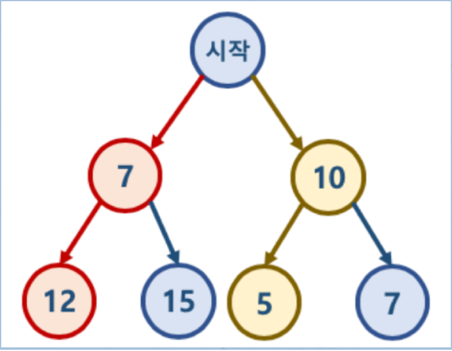

#Greedy Algorithm

---
- 정의
> 각 단계에서 최적의 선택을 하는 방식으로 문제를 해결하는 방식

- 이와 같이 구현 방식이기 때문에 예제를 보면 이해가 잘된다.


- 위 그림은 경로를 따라 더한 값이 가장 작은 값을 찾아야 하는 문제인데
 <br>시작에서 작은 값은 7, 그리고 그 다음 단계에서 작은 값은 12이므로 둘을 더하면 19
- 이처럼 그 단계마다 가장 최적의 값을 차근차근 찾아나가는게 그리디 알고리즘이다.
- 근데 여기서 한계가 있다.

> 그리다 알고리즘은 최적의 답을 항상 내는 것이 아니다.
- 이 갈색 라인을 타고 가게 되면은 10 + 5 = 15이므로 15
<br> 즉, 그리디 알고리즘으로 구한 19보다 실제로 제일 작은 값이 나오게 된다.

[백준 5585 거스름돈](https://www.acmicpc.net/problem/5585)

```java
import java.util.Scanner;

public class Baekjoon5585 {
    static final int TOTAL = 1000;

    public static void main(String[] args) {
        Scanner scanner = new Scanner(System.in);
        int[] coin = {500, 100, 50, 10, 5, 1};
        int leftCoin = TOTAL - scanner.nextInt();
        int index = 0;
        int sum = 0;

        while (leftCoin != 0) {
            sum += leftCoin / coin[index];
            leftCoin = leftCoin % coin[index++];
        }
        System.out.println(sum);
    }
}
```

[백준 1026 보물](https://www.acmicpc.net/problem/1026)
```java
import java.io.BufferedReader;
import java.io.IOException;
import java.io.InputStreamReader;
import java.util.Arrays;
import java.util.Comparator;
import java.util.Scanner;
import java.util.StringTokenizer;
import java.util.function.Function;

public class Baekjoon1026 {

    public static void main(String[] args) throws IOException {
        Scanner scanner = new Scanner(System.in);
        int N = scanner.nextInt();
        Integer[] A = new Integer[N];
        Integer[] B = new Integer[N];
        Function<String, Integer> stringToInt = Integer::parseInt;

        BufferedReader bufferedReader = new BufferedReader(new InputStreamReader(System.in));
        StringTokenizer stringTokenizer = new StringTokenizer(bufferedReader.readLine());
        for (int i = 0; i < N; i++) {
            A[i] = stringToInt.apply(stringTokenizer.nextToken());
        }
        Arrays.sort(A);
        stringTokenizer = new StringTokenizer(bufferedReader.readLine());
        for (int i = 0; i < N; i++) {
            B[i] = stringToInt.apply(stringTokenizer.nextToken());
        }
        Arrays.sort(B, Comparator.reverseOrder());
        int sum = 0;
        for (int i = 0; i < N; i++) {
            sum += A[i] * B[i];
        }
        System.out.println(sum);
    }
}

```